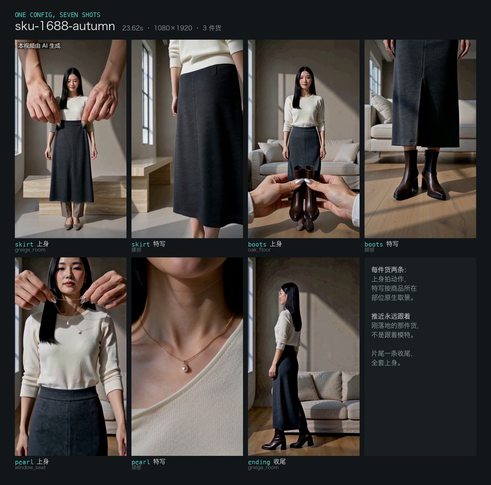
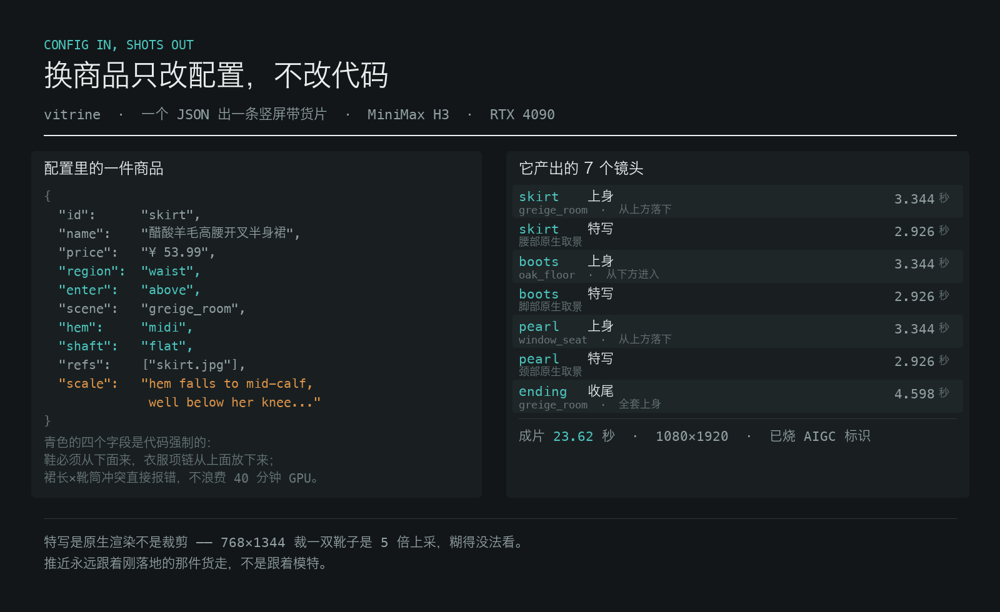

# vitrine —— 配置驱动的服饰商品视频产线

一个配置文件出一条竖屏带货片。**换商品只改配置，不改代码。**



*上图是 `configs/sku-1688-autumn.json` 真实跑出来的成片抽帧：3 件货、7 个镜头、23.62 秒，
片头的 AIGC 标识是交付关卡烧上去的。*



```bash
pip install -e .
vitrine --backend null doctor              # 看 ffmpeg、中文字体、节拍网格齐不齐
vitrine --backend null check configs/demo.json    # 校验配置，并列出还缺哪些素材

# 不用显卡先把整条流水线跑一遍（产出带标记的占位素材，不是成片）
vitrine --backend null model-ref configs/demo.json
cp ~/vitrine-jobs/demo-assets/cand_1.png ~/vitrine-jobs/demo-assets/model.png
vitrine --backend null make configs/demo.json
```

跑完你会看到交付关卡**拒绝**给占位素材打 AIGC 标识——那是设计好的，不是报错。

真出片要配一个渲染后端：

```bash
cp vitrine.example.toml vitrine.toml     # 填 comfy_root / workflow_template
vitrine doctor
vitrine make configs/你的配置.json --producer "你的公司"
```

---

## 实测数字（RTX 4090 24GB，2026-08-24）

不是估算，是 `nvidia-smi` 每秒采样出来的。

| 指标 | 实测值 |
|---|---|
| 单镜头渲染 | **261–298 秒**（8 镜头满集均值 263.1s，区间 261.2–267.3s） |
| 单镜头 GPU 能耗 | **33.5 Wh** |
| 渲染时平均功耗 | **391.5 W**（峰值 462.8 W，空闲 12.9 W） |
| 峰值显存 | **21,690 MiB** / 24,564 MiB |
| 每秒成片的 GPU 代价 | **57.7 秒** |
| 一条 7 镜头成片 | 约 **32 分钟 GPU**、**0.21 kWh** |
| 成片规格 | 1080×1920 h264，25.8 秒，22.4 MB |

按居民电价 ¥0.55/kWh 算，一条成片的 **GPU 电费约 ¥0.12**；整机（CPU/内存/电源损耗）
按 +30% 估约 ¥0.15。

**这个数字只是边际成本。** 真正的成本是那张卡本身的摊销，以及废片率——
上面的时间是渲染成功的时间，不含重拍。别拿电费当"成本"讲。

---

## 四个阶段

```
bible     每件商品出一张唯一的标准商品图（厂家给了图就跳过）
render    逐件循环：建镜头 → 渲染 → 取末帧当下一件的接力参考
edit      按拍子剪 + 价格牌 + 参数卡 + 配乐 + 质检
deliver   烧 AIGC 显式标识 + 写隐式元数据 + 读回验证
```

阶段会跳过已完成的，所以 40 分钟的渲染中途挂了是续跑，不是重来。
`--from render` 强制从某个阶段重跑。

```bash
vitrine render configs/x.json dress_detail ending   # 只重渲这两条，不动已验收的邻居
vitrine make   configs/x.json --from edit           # 只重剪
vitrine batch  configs/                             # 整个目录一条条跑
```

---

## 一致性是怎么保住的

视频模型每次调用**不带任何状态**。所以三个东西必须靠参考图显式带过去，
参考槽正好三个：

| 槽 | 内容 | 保住什么 |
|---|---|---|
| 0 | 模特身份图 | 她是谁 |
| 1 | 该商品的唯一标准图 | 上身那条和特写那条**是同一件东西**、同样粗细 |
| 2 | 上一件拍完的末帧 | 已经穿在身上的整套，**扛得住场景切换** |

槽 1 解掉的坑：上身和特写是两次独立生成，模型把项链**各编了一次**，
身上那条和特写那条粗细对不上。现在两条共用同一张商品图。

槽 2 解掉的坑：换了场景她就换了衣服。末帧里她穿着到目前为止的全套。

每件商品**必须**填 `scale`（真实尺寸 + 怎么长在身上），同一句话原样注进
上身和特写两条提示词。不填直接报错——图只定"是什么"，`scale` 定"多大"。

**代价：必须逐件顺序渲。** 第 N+1 件要用第 N 件的末帧，所以卡再闲也并行不了。

---

## 配置里写死的两条硬规则

**商品特写必须框商品，不能框模特。** 靴子穿上之后切到她的脸，
等于把要卖的东西藏起来。特写镜头从商品自己的 DETAIL 素材出，按它的身体部位取景。

**下摆和靴筒会打架。** 中长裙配过膝靴，靴口正好落在裙摆里，
腿的线条断成两截，提示词怎么写都救不回来。`compat.py` 在花掉四十分钟 GPU 之前拦下来。

---

## 渲染后端是可换的

`ShotSpec` 只描述任何视频模型都需要的东西——提示词、参考图、尺寸、长度、种子。
引擎特有的部分归后端管。

| 后端 | 用途 |
|---|---|
| `comfy_h3` | 本地 ComfyUI + MiniMax H3。自己起服务、自己停，拒绝挂到别人已经起好的端口上 |
| `null` | 生成**带标记的占位素材**：尺寸、时长、帧率都对，用来验证接线，**不是交付路径** |

加一个云端模型 = 加一个模块 + 注册表里加一行，产线其余部分不用动。

`null` 后端跑出来的片子会被交付关卡拒掉：

```
refusing to deliver: this cut was assembled from null-backend placeholders.
… an AIGC label on colour bars is a false declaration, not a formality.
```

---

## AIGC 标识是关卡，不是选项

GB 45438-2025 对在中国销售的生成视频有两条独立义务：
片头可见标识（5.4）和容器里的机器可读标识（附录 E）。两条都做完才算能发。

隐式标识写完会**读回验证**，读不到就不返回成功。
顺序不可换：先烧后写——写完元数据再转码会把元数据丢掉。

---

## 自备音轨

节拍网格只有两个数：一拍多长、第一拍在哪。从你**自己有版权的**音轨里推：

```bash
vitrine beatgrid path/to/your-track.mp3       # 需要 numpy
```

**音乐模型生成的曲子往往比你要的短。** 本地 MiniMax Music 3 无论 `max_duration`
填多少，实测都在 15–22 秒之间收尾（试过在提示词里写死 "sixty seconds / no ending"，
反而更短）。所以短曲子要**按小节对齐循环**加长：

```bash
vitrine bed my-track.mp3 --seconds 34         # 输出 assets/audio/bgm.mp3 + beatgrid.json
```

循环点落在从检测到的第一拍起算的**整数个小节**上——重复最不容易被听出来的位置，
接缝正好落在下一个强拍本来就该出现的地方。顺带把模型的前奏和收尾切掉，
垫乐本来就不需要它们。

包里自带的是一个 120 BPM 的默认网格，够跑通流程。
没配 `bgm` 时成片是无声的，报告里会写明。

> 本仓库不附带任何音频。原始产线从一个来源不明的 mp3 读节拍，
> 那在一台机器上没问题，一旦分享就是版权问题。

---

## 跨平台

在 macOS / Windows / Linux 上都能跑。所有机器相关的东西集中在 `settings.py`，
解析顺序：**环境变量 → `vitrine.toml` → 平台默认值**。

中文字体自动探测（Windows 微软雅黑 / macOS PingFang、Hiragino / Linux Noto CJK），
找不到就报错说清楚，不会静默降级成方框。

**没有配置渲染后端时不会偷偷降级。** 报错会告诉你两条路：
配一个真后端，或者 `--backend null` 做接线测试。
一次打印 "done" 却交出彩条的运行，比直接停下来更糟。

---

## 依赖

- Python ≥ 3.11、ffmpeg / ffprobe（在 PATH 上就行）、Pillow
- `pip install -e ".[beatgrid]"` 加 numpy，用于节拍分析
- `pip install -e ".[local]"` 加 torch / diffusers，仅在需要本地生成商品图时

不依赖任何私有内部包。AIGC 标识模块已内联进 `vitrine/aigc/`。
